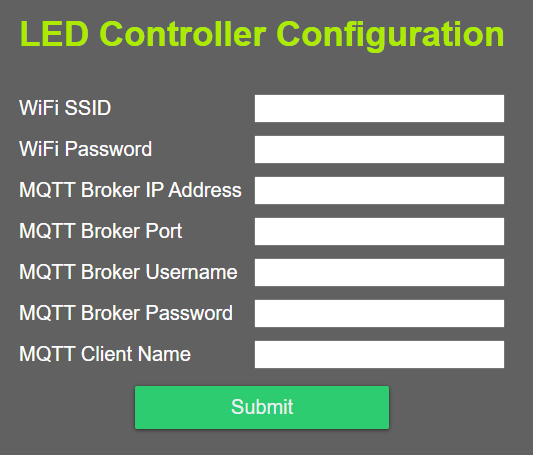

# 12VLEDControllerMk4

## Features
- Control for 2x 12V RGBCWWW LED Strips 
- Support for 2x 5V PIR Motion Sensors
- NTP time based brightness adjustments for motion detection 
- Phase Shifted PWM channels for load balancing while dimming
- Current and voltage measurements
- Flash storage of configuration against power lose
- Webpage based configuration via accesspoint
- Controllabled via Homeassistant and JSON
- Programmed in C++ and Arduino via VS Code
- Nodemcu ESP8266 microcontroller with WiFi
- OTA Sketch updates possible

## Roadmap 
- OTA Github updates of Sketch
- Rework of power messurement unit
- Sync option for led strip effects on both strips
- STL for MK2 PIR Housing
- Wiring diagram

## Known Bug's
- PCA9685 thrwos cassualy IC2 errors => needs reset
- Power messurment unit calc wrong => fixing calc with new shunt resistor

## What you need
  * 1x Assembled LED Controller PCB 
  * 1x Nodemcu ESP8266
  * 1x or 2x 12V LED Strips with cavles connected to a 6 PIN JST XH connector (Supported variants are: RGB, RGBCW, RGBWW, CW, WW, CWWW, RGBCWWW)
  * 1x or 2X 5V PIR Sensor with cables connected to a 3 PIN JST XH connector
  * A Computer with Arduino installed
  * A USB A to micro USB cable
  * A 12V power supply with enough power for the connected LED Strips. Used connector is a DC hollow plug 5.5mm * 2.5mm and a length of 9mm
  * Optional 1x MK4 LED Controller Housing
  * Optional 1x or 2x MK2 PIR Sensor Housing

## Instalation (Homeassistant and JSON)

   The diffrence between Homeassistant and JSON are the diffrent MQTT paths and data structures / commands

1. Download newest release
2. Flash Sketch to Nodemcu
3. Connect Power
4. OnBoard LED on the Nodemcu should flash. This indicates that we are in the configuration mode
5. Connect to accesspoint with the SSID "LED Controller Mk4"
6. Go to the webpage located at 192.168.4.1
7. Configure all neede settings shown in the image below

8. Submit configuration and wait a few seconds. OnBoard LED on the Nodemcu should stop flashing.
   
   If you messed the configuration up just press the flash button for at least 5 Seconds.  
   After that the OnBoard LED will start flashing again and we are again in the Configuration mode.  
   At that point go back to step 5.  
   
9. Configure Homeassistant. You need:
  * 1 MQTT Light for LED Strip 1
  * 1 MQTT Light for LED Strip 2
  * 1 MQTT Light for Motion Detection 
  * 1 MQTT Switch for adaptive motion brightness based on the current time
  * Automation for Master Present or 1 MQTT Switch
  * Automation for Sunfall and Sunrise
  * Input number and MQTT publish automation for motion detection timeout
  
  !!! Check for the right payload and MQTT retain flags !!!
  
10. After the configuration is finished you are ready to go. 
  
  
## Homeassistant MQTT Paths
  * Sunfall and Sunrise
  
   "LEDController/Global/HomeAssistant/Sun/command"  
  
  * Master Present
  
   "LEDController/Global/HomeAssistant/MasterPresent/command"  
  
  * Alarm
  
   "LEDController/Global/HomeAssistant/Effect/Alarm/command"  
  
  * Motion Detection
  
   "LEDController/`{Configured MQTT Client Name on LED Controller}`/HomeAssistant/MotionDetection/BrightnessTimeBasedEnabled/command"
   "LEDController/`{Configured MQTT Client Name on LED Controller}`/HomeAssistant/MotionDetection/Enabled/command"  
   "LEDController/`{Configured MQTT Client Name on LED Controller}`/HomeAssistant/MotionDetection/RGB/command"  
   "LEDController/`{Configured MQTT Client Name on LED Controller}`/HomeAssistant/MotionDetection/RGB/Brightness/command"  
   "LEDController/`{Configured MQTT Client Name on LED Controller}`/HomeAssistant/MotionDetection/White/command"  
   "LEDController/`{Configured MQTT Client Name on LED Controller}`/HomeAssistant/MotionDetection/White/Brightness/command"  
   "LEDController/`{Configured MQTT Client Name on LED Controller}`/HomeAssistant/MotionDetection/Timeout/command"  
  
  * LED Strip 1
  
   "LEDController/`{Configured MQTT Client Name on LED Controller}`/HomeAssistant/Strip1/Power/command"  
   "LEDController/`{Configured MQTT Client Name on LED Controller}`/HomeAssistant/Strip1/RGB/command"  
   "LEDController/`{Configured MQTT Client Name on LED Controller}`/HomeAssistant/Strip1/RGB/Brightness/command"  
   "LEDController/`{Configured MQTT Client Name on LED Controller}`/HomeAssistant/Strip1/White/command"  
   "LEDController/`{Configured MQTT Client Name on LED Controller}`/HomeAssistant/Strip1/White/Brightness/command"  
   "LEDController/`{Configured MQTT Client Name on LED Controller}`/HomeAssistant/Strip1/Effect/command"  
  
  * LED Strip 2
  
   "LEDController/`{Configured MQTT Client Name on LED Controller}`/HomeAssistant/Strip2/Power/command"  
   "LEDController/`{Configured MQTT Client Name on LED Controller}`/HomeAssistant/Strip2/RGB/command"  
   "LEDController/`{Configured MQTT Client Name on LED Controller}`/HomeAssistant/Strip2/RGB/Brightness/command"  
   "LEDController/`{Configured MQTT Client Name on LED Controller}`/HomeAssistant/Strip2/White/command"  
   "LEDController/`{Configured MQTT Client Name on LED Controller}`/HomeAssistant/Strip2/White/Brightness/command"  
   "LEDController/`{Configured MQTT Client Name on LED Controller}`/HomeAssistant/Strip2/Effect/command"  
          

## JSON MQTT Paths

  Coming in the future

## JSON Data Strucutres

  Coming in the future

## Used Libraries
[NTPClient](https://github.com/arduino-libraries/NTPClient)

[PubSubClient](https://github.com/knolleary/pubsubclient)

[ArduinoJSON](https://github.com/bblanchon/ArduinoJson)

## Electronics
- 1x NodeMCU for controlling the LED Strips and handling communication
- 1x INA219AIDR for current and voltage measurements
- 1x PCA9685PW phase shifted PWM signal generation for the Mosfet
- 10x N-Channel Mosfets for driving the 2 LED strips

## Schematic / PCB
- You can find the PCB and Shematic under https://easyeda.com/XBoter/led-controller-mk4

## Housing
- 3D Printed housing
- Printed with Prusa Mini and Prusament PLA Prusa Galaxy Black 
- You can find the stl files in the 3dmodel folder

## Images

## Warning

   I am hear with not responsible for any failure or fire, destruction or any other kind of harm caused by the LED Controller. 
   The use of the LED controller is your own responsibility.
