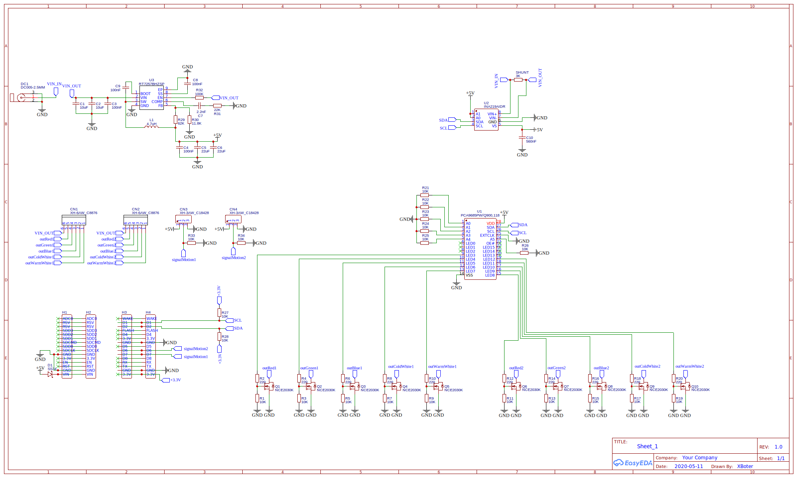
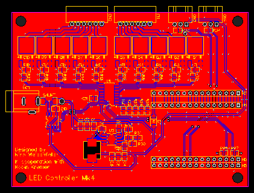
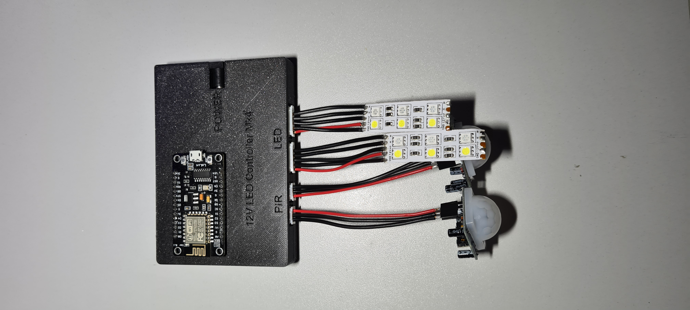
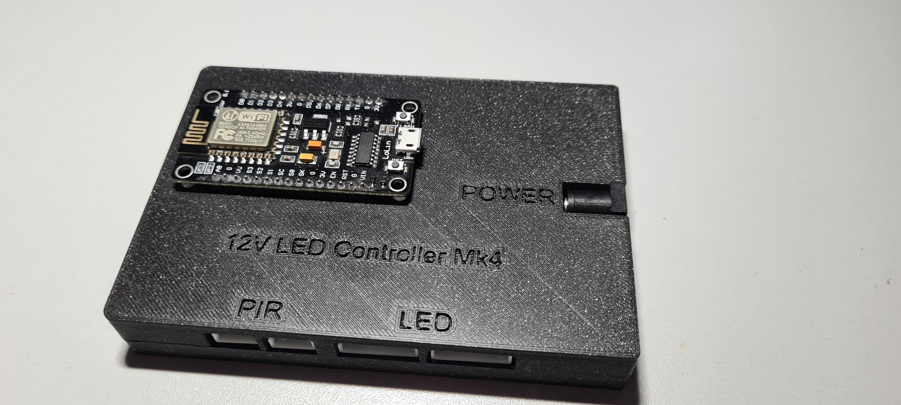
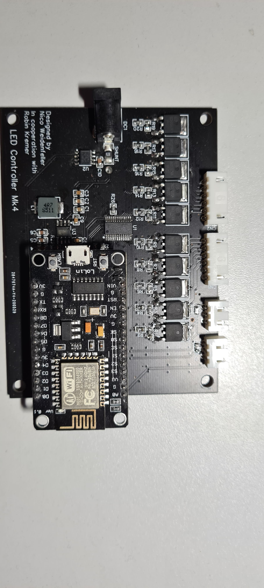
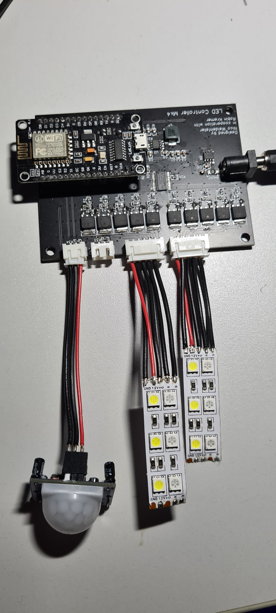

# 12VLEDControllerMk4

## Features
- Controls for 2x RGB/CW/WW LED strips
- Support for 2 PIR sensors for motion detection
- Time based brightness control for motion detection
- Phase Shifted PWM for load balancing while dimming
- Current and voltage measurements and updates via MQTT
- Controlled by a ESP8266 (NodeMCU) via WiFi and MQTT over Home Assistant

## Software
- Programmed in C++ via VS Code 
- Code Upload to ESP8266 via the Arduino Extension for VS Code

## Electronics
- 1x NodeMCU for controlling the LED Strips and handling communication
- 1x INA219AIDR for current and voltage measurements
- 1x PCA9685PW phase shifted PWM signal generation for the Mosfet
- 10x N-Channel Mosfets for driving the 2 LED strips

## Schematic / PCB
- You can find the PCB and Shematic under https://easyeda.com/XBoter/led-controller-mk4

## Housing
- 3D Printed housing
- Printed with Prusa Mini and Prusament PLA Prusa Galaxy Black 
- You can find the stl files in the 3dmodel folder

## Images

## Used Libraries
[NTPClient](https://github.com/arduino-libraries/NTPClient)

[PubSubClient](https://github.com/knolleary/pubsubclient)

[ArduinoJSON](https://github.com/bblanchon/ArduinoJson)
